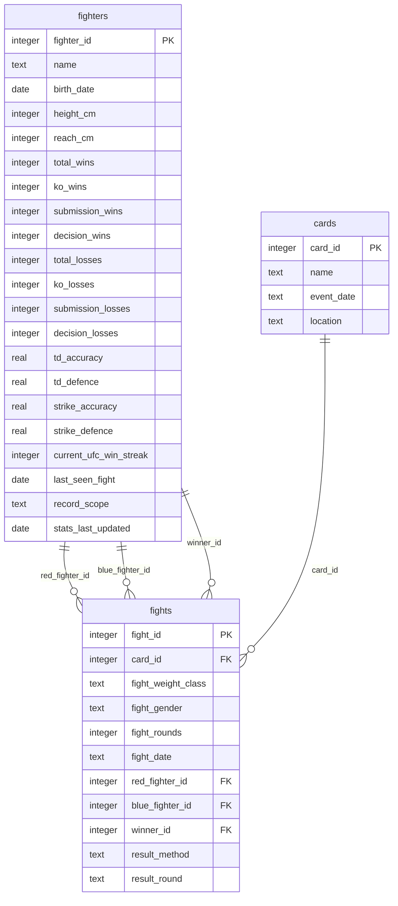

# Fight Predictor API

Local backend service for the MMA fight predictor using SQLite.

## Database schema

The current database design is intentionally small and focused on three core tables:

- `fighters` stores the fighter profile and the latest collected summary stats
- `cards` stores the event or fight card metadata
- `fights` stores the individual bout record and links it to a card plus the two fighters involved



## Notes on the design

- `fighters` is the authoritative record for each fighter and holds the latest collected stat snapshot.
- `cards` represents a fight night or event and can contain many fights.
- `fights` does not duplicate fighter stats. It only stores the fighter IDs and the result metadata needed for analysis.
- The fighter summary values are stored as snapshot data and are intended to be refreshed over time. The `record_scope` and `stats_last_updated` fields make that explicit.
- The import workflow creates cards dynamically from the imported fight data so the schema stays normalized without requiring a separate manual card entry step.

## Local setup

No additional runtime packages are required yet. The current focus is the database import and schema.

```bash
cd /home/waltf/Code/ww-web-apps/services/fight-predictor-api
python3 app/main.py
```

This will create or refresh the SQLite database and print the number of imported fighters and fights.

## What is in scope right now

- SQLite schema in [schema.sql](schema.sql)
- database bootstrap/import logic in [app/database.py](app/database.py)
- a minimal local entrypoint in [app/main.py](app/main.py)

## What is intentionally deferred

- a full HTTP API layer
- request/response models
- deployment concerns

Those can be introduced later once the database schema is stable.
